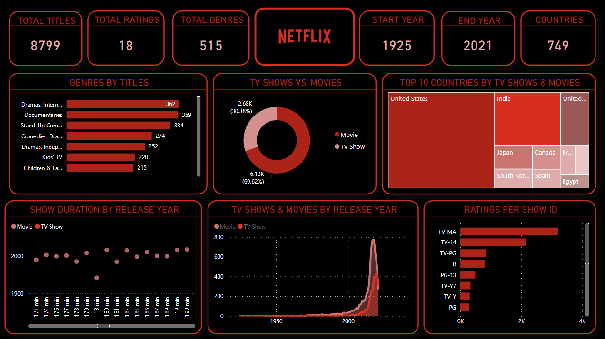

# Netflix-PowerBI-Interactive-Dashboard

## Overview
This project involves the analysis of Netflix data using a Power BI dashboard to provide insights into the streaming platform's content library and user engagement. The analysis aims to uncover trends in content type, genre distribution, release years, and user preferences, helping to inform strategic decisions for content development and user retention.

## Dataset Description
The dataset used in this project contains detailed information about Netflix's content library. It includes the following key attributes:

* Title: The name of the content.
* Type: Whether the content is a movie or a TV show.
* Director: The director of the content.
* Cast: Main actors involved in the content.
* Country: The country of origin of the content.
* Date Added: The date the content was added to Netflix.
* Release Year: The year the content was originally released.
* Rating: The content rating (e.g., PG, R, etc.).
* Duration: The duration of the content (in minutes or number of seasons for TV shows).
* Genre: The genre(s) of the content.
* Description: A brief description of the content.

 

